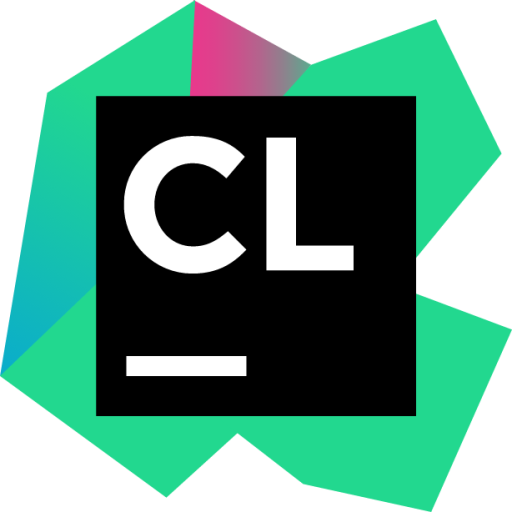
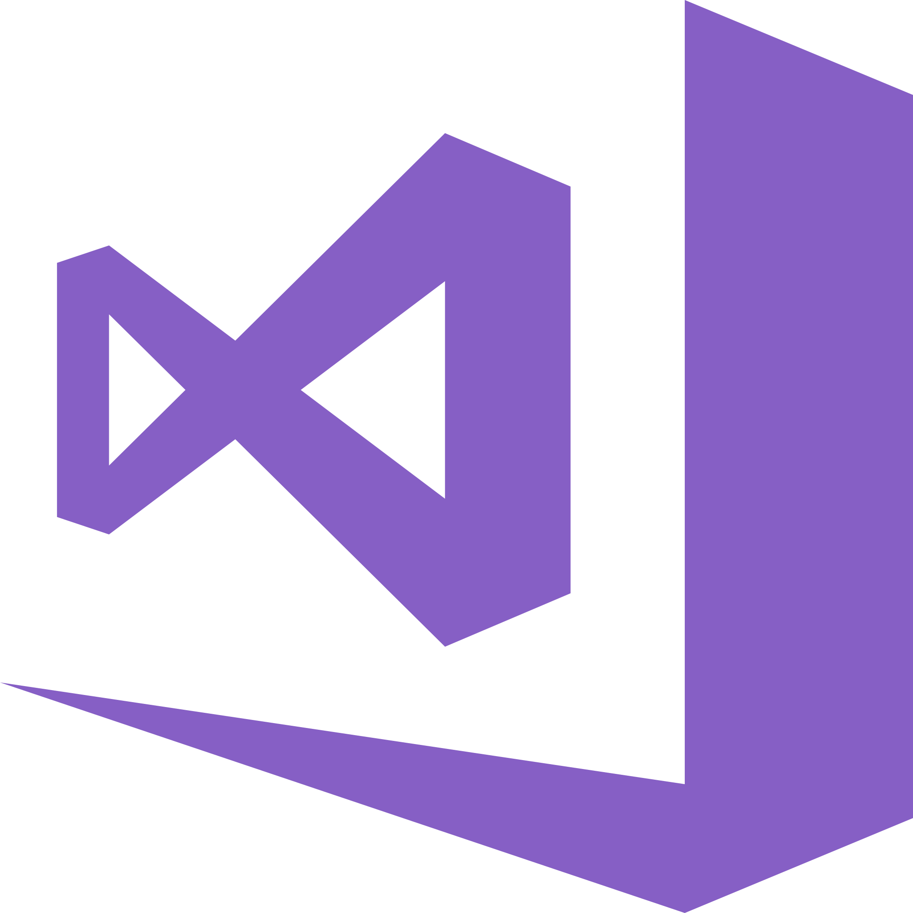
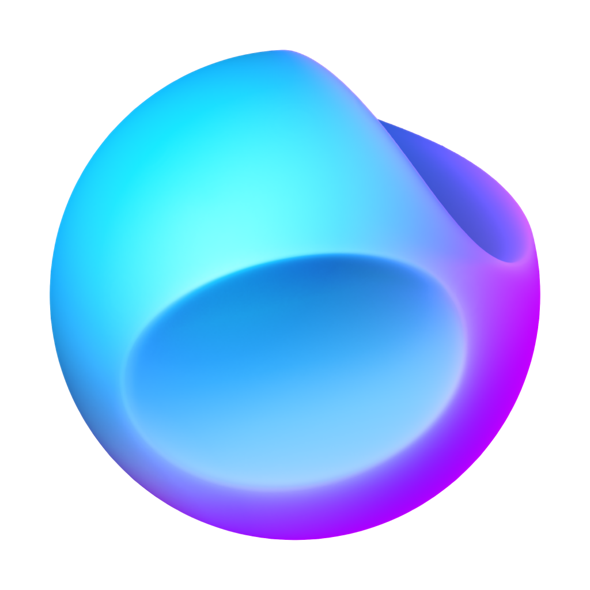

 
    

  

  
  
  

<h2>🚀 About Me </h2>

* 💻 I'm 22 years and I'm passionate about **software/mobile and web application** development.
* 💼 Currently I am in the second year of a master's degree in computer science, in the field of software architecture.
* 📫 You can contact me at **benjamin.valleix@gmail.com**
* 🔗 Other links :

  
  
    

## 📊 My Profile Statistics

### 🧮 Global stats

### 🏆 Trophies

## ✏️ Languages and Tools
## OS

  
	
	
	
	

## IDE

    
	  
    
    
    
    
    
    
    
    
	
    
    
    
    

## Languages

## Frameworks & Libraries

## DataBase

## Platforms / Interface

