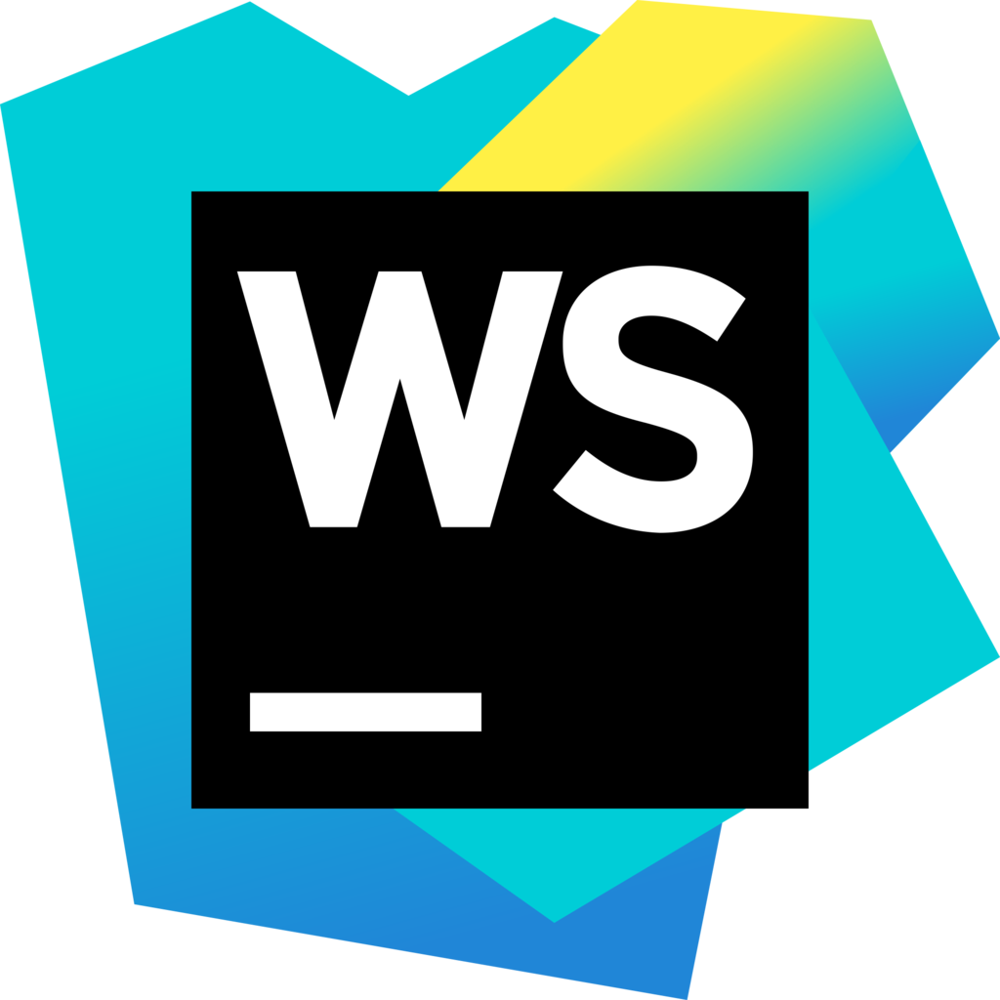

  

<h1 align="center">Hello 👋, I'm Benjamin</h1>

## 📍 About ME

- 💻 I'm 20 years and I'm passionate about **software/mobile and web application** development

- 🌱 I’m currently learning **mobile development**

- 📫 You can contact me at **benjamin.valleix@gmail.com**

- 🔗 Other links :
 

<h2 align="center">

</h2>

## ✏️ Languages and Tools
## OS

    
	
	
	
	

## IDE

    
	
    
    
    
    
    
    
    
	
    

## Languages

## Frameworks & Libraries

## DataBase

## Platforms / Interface

